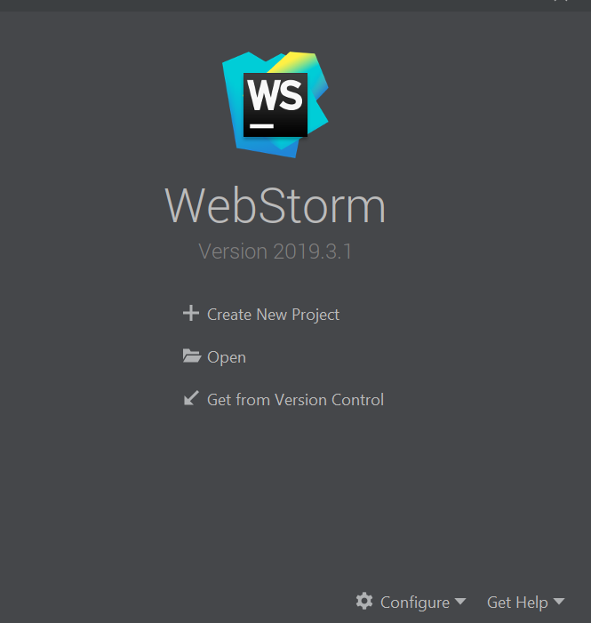
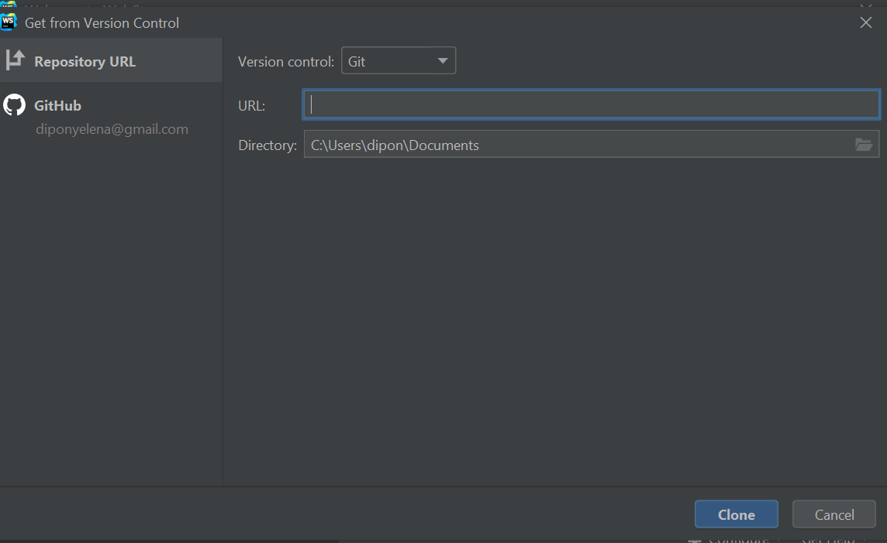
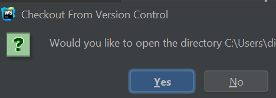
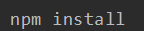
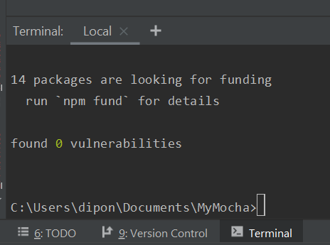

# What is MyMocha? 
MyMocha is my repository containing different functions and tests for each function.

#### Installation

##### 1) Open WebStorm

If not yet installed please visit https://www.jetbrains.com/webstorm/download/ and follow the instructions on the web for installation.

##### 2) Once you get to a Welcome Page on WebStorm, click on the very last option "Get From Version Control"



##### 3) Screen similar to a picture below should appear. 
Click on the left click on "Repository URL"

In "URL" field past  "https://github.com/YelenaDipon/MyMocha.git"

Click "Clone" on the bottom right 



##### 4) Click "Yes" for a screen which will pop up
 
 

##### 5) Open up a terminal on the bottom left of your WebStorm screen, type in "npm install".

Example: ```$ npm install ``` and click "enter"

  

##### 6) Once terminal has completed a process of installation and a message below shows up, you are able to use all of the functions and tests in the repository.
 


#### Usage

The primary use for this repository is test out created functions, modify them, and get more practice/knowledge.
Functions are located in `index.js` file and tests are located in `test` folder / `index.spec.js` file. 

#### Details

This repository will be acquiring new functions often. 

Explanation of each test and functions are and will be indicated in their title/description.